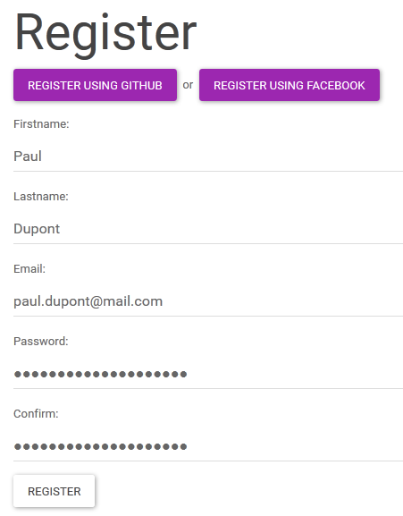
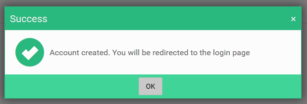
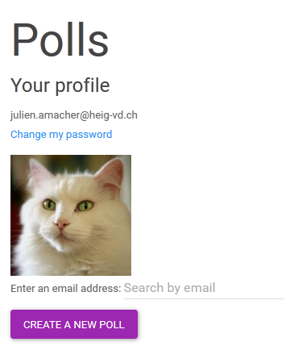
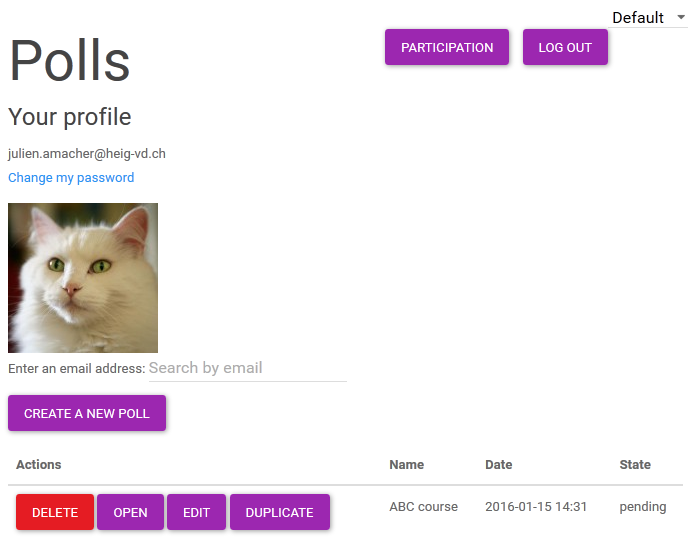

## User manual

## Open the website

Go to the website using your Web browser by clicking on the following link : https://shrouded-falls-6875.herokuapp.com

## Register a new account

Register a new account if you don't already have one by clicking on the "Register new account" link.

Input the required information:

and then click on Register:

Your account is now created and you should be redirected to the login screen.

## Login

Input your email address and the associated password and then click Login.

Your home page is shown:

To log ou, click on Log out.

## Create a new poll

In order to create a new poll, click on Create a new poll on your home page.

First, specify the name of the poll on the top of the page (replace the default value, SuperPOLL)

By default, several questions and answers are already shown. You can either delete them or use them as a start point by modifying them.

In order to delete a question, click on Delete on the right of the question. You can also move them up and down according to your needs.

For each question:
* Specify its name (between 5 and 50 characters)
* Specify its attributes
  * "Allow anonymous" will allow people to vote without disclosing their identities, if they so choose (they can always decide to vote non-anonymously)
  * "Max vote per user" denotes the maximum votes a single user can cast on the answers (between 1 and 10). For example, if a question has two answers (Yes and No) and the maximum number of vote per user is 5, a single user can vote 3x Yes and 2x No.
  * "Timeout" is the duration of the vote for this question, in seconds (between 15 and 600)

A poll can contain at most 50 questions.
Hint: You can add a question at a specific position by clicking on Add question here

Finally, specify its answers.
You can:
  * Click on Add answer to add an answer to the question
  * Click on delete to remove an answer
  * Click on Up or Down to change the ordering of the answers

  

At least two answers must be specified per question.

When you are done, click the Save poll button.

You are now redirected to your home page. It shows the newly cleated poll:

You can edit the poll (add a question, add answers, etc.) by clicking on the Edit button.

## Open a poll

When you are ready to show your poll to the world, click on the Open button next to the desired poll.

See the next section for details on how to manage an open poll.

## Manage an open poll

When you join your own poll, you are automatically joined as "speaker" and are the only one who can manage it.

A screen similar to this one should be shown:

The bottom part shows the list of every user connected to your poll. It should be empty if you just opened it.

Tell your audience your email address. They should follow the "Join a poll as audience" section.

You can see the list of users being populated as people join your poll:

When you are ready to display the first question, click on Go to the next question. Don't worry if you start too soon, people can join the poll even if it has begun.

You can see what people vote in real time. Graphs and vote counts are updated as soon as a vote is received.

On the upper right side, the graph shows results per answer. You can hover your mouse to get more information.
On the lower right side, the graph shows participation over time.

A tick is shown on the left of each user who casted at least one vote on the current question (exception: when the question allows anonymous voting, no such tick is displayed)

When you are ready to go to the next question, click Go to the next question.

Once every question has been shown, the poll is automatically closed (no one can join it any more) and you can access its stats by clicking View poll results.

See the "View poll stats" section.

## Join a poll as audience

To join a poll opened by someone alse, first go to the website and then proceed to log in.
Next, input the speaker's email address in the search box (or begin typing it).

Users having an email address beginning with the specified search criteria are shown, as well as their opened polls:

Click on Join to join the desired poll.

When joined, you have to wait for the speaker to display a question:

When a question is displayed, you are free to vote:

## View poll stats

When you click on View poll results in a finished poll or click on View results from your home page, the poll stats are displayed.

You can click on Go back to return to the home page.