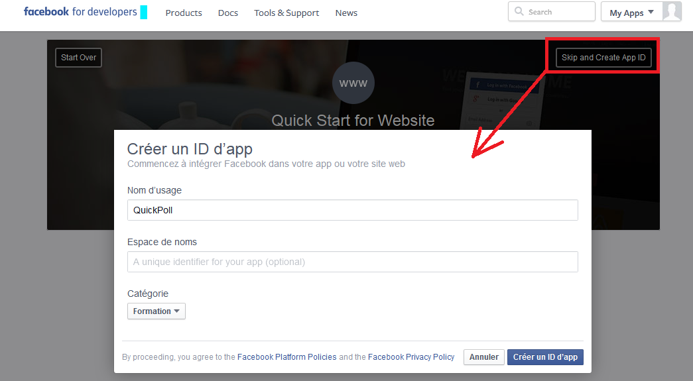
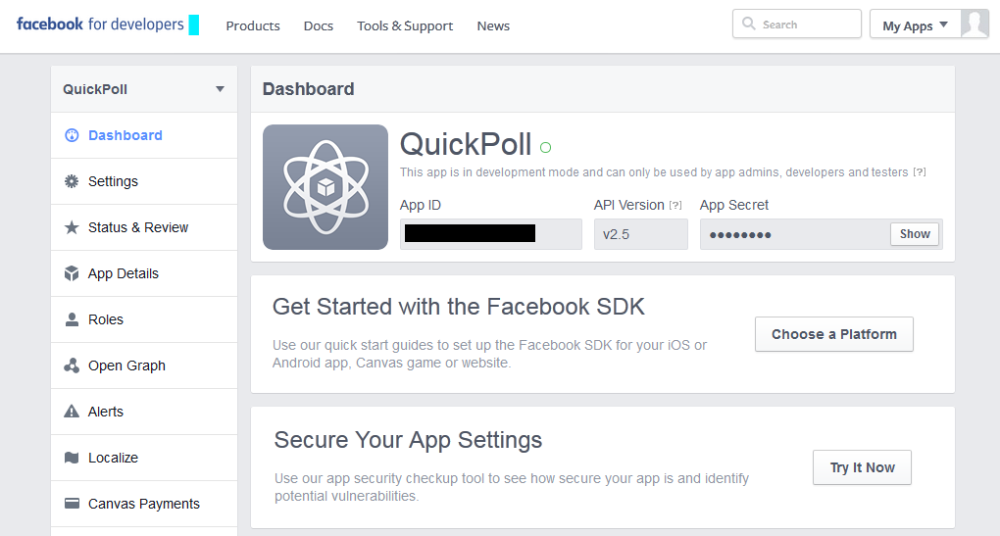
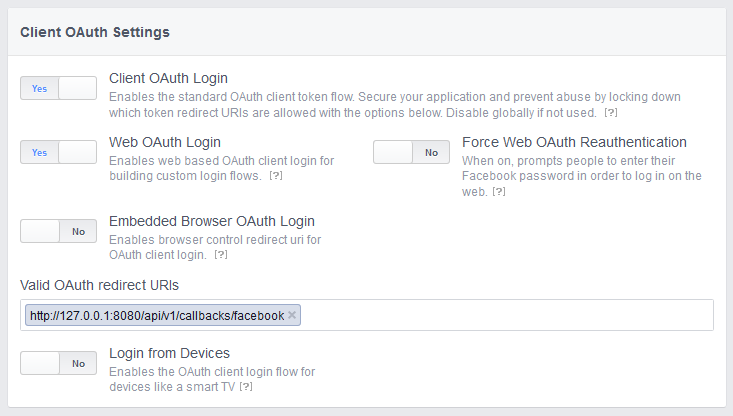
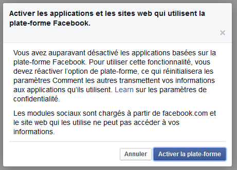
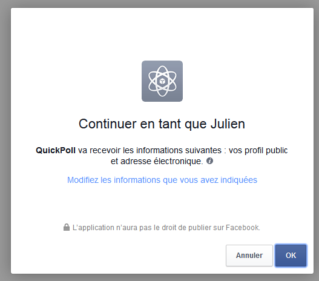

# How to obtain a ClientID and Client Secret from Facebook

* First, go to https://developer.facebook.com and enroll as a developer. You must already be logged as a regular user in Facebook.
* Facebook will ask you to confirm your identity either by sending you an SMS or by linking a credit card
* One done, click on "Website" as application to register
* Click on Skip and Create App ID

  

* In the new window, specify:
  * The application name (for example: QuickPolls)
  * A category
* Click on Create an App ID
* You will be redirected to your application dashboard and will see the new application:

  
  
  Note your App ID and your secret.

* One final thing to do is to whitelist your callback address. To do so, edit the "Valid OAuth redirect URIs":

  
  
* When clients will use your application, they will first need to enable external websites to access their data (if they did not already allow it):

  

  And then will be presented with this alert, which they will need to allow.

  
  
  Finally, they are redirected to the callback URL.