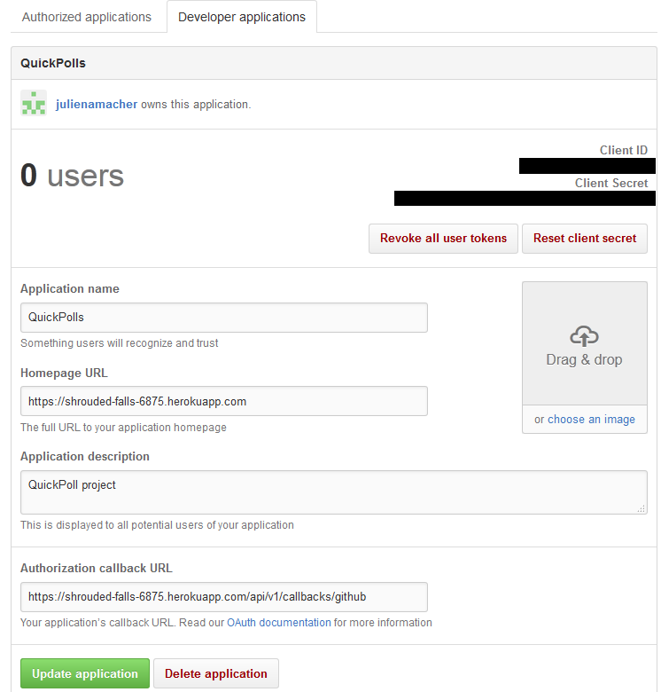
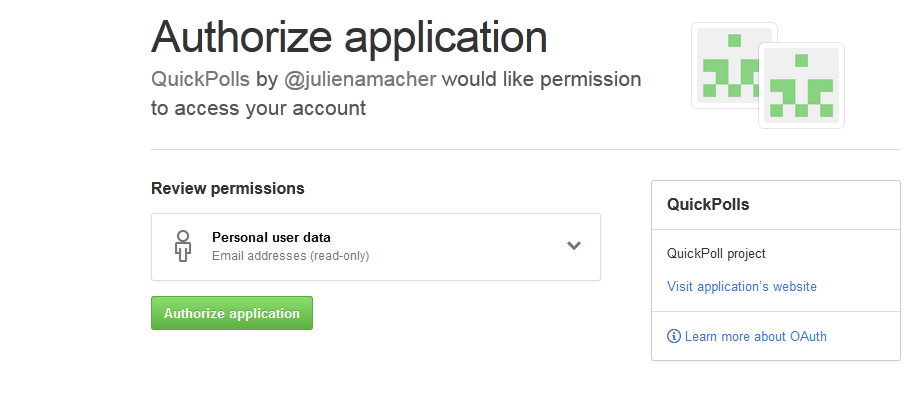

# How to obtain a ClientID and Client Secret from GitHub

* First, go to https://developer.github.com/v3/oauth/ and click on the Register their application link.
* Proceed to log in with your GitHub credentials
* In the Register a new OAuth application  which should now be displayed, enter:
  * The application name (for example: QuickPolls)
  * The project homepage url (for example: https://shrouded-falls-6875.herokuapp.com)
  * An application description (for example: QuickPoll project)
  * The application callback URL. (for example https://shrouded-falls-6875.herokuapp.com/api/v1/callbacks/github)
* Click on Register application
* Your Client ID and Client Secret are now displayed.

Once users will login/register using our application, they will first need to allow it:

