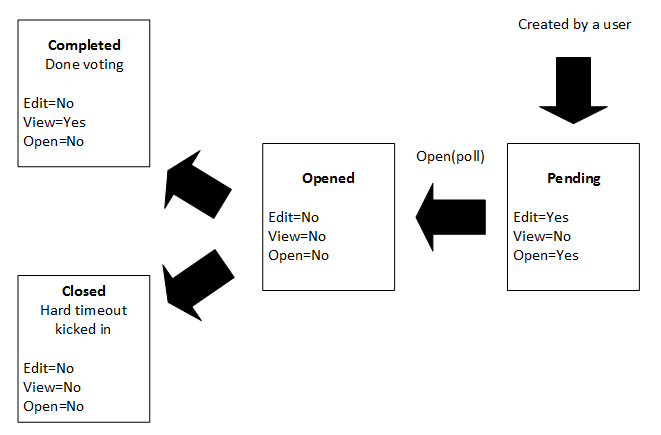

TWEB - Project

Description of the product
========================================
QuickPoll is a web based application which allows customers to create, join, manage and partitipate to different polls. It is an ideal product for classrooms and education.

Target users
========================================
Everyone who want to get a free and fast poll tool.

For instance, in a school:

Nowadays, nearly everybody in a school have a smartphone or a computer and we can use it to spare everybody's time ! If the teacher has questions to ask to the classroom he can prepare those in advance by creating a poll and when it's time to ask those questions to the students, he simply  give them the link of the application and his email address (so others can find his poll(s))

Description of the usecases
========================================
This section provides the first draft of the TWEB's project specifications and usecases.

----------------------------------------
1) Login
----------------------------------------
The user starts on the home page of the app where he has two choices:
	Create an account, which requires providing an e-mail address and a password
	Login with the credentials (he already has an account)

----------------------------------------
2) Create Poll
----------------------------------------
Once the user is logged, he can create a Poll by giving it a name, and editing the
questions and the answers.
For each question, he can choose if it is possible to answer anonymously to it or not.

----------------------------------------
3) Open Poll
----------------------------------------
When the Poll is ready to be used by others users, the creator can open it. The Poll's
creator can now start the poll by displaying the first question, which will be displayed on every logged users devices.
A question has a timer which allows the user to answer only during the allotted time.
The results are live updated - immediately when the users validate their answers.
After each question, the creator can go on to the next question.

----------------------------------------
4) Close Poll
----------------------------------------
When all questions have been answered by the users, the poll is deemed completed.
The users can't access the questions anymore and no one can vote on that poll.
The creator can view the results of every questions of the Poll.

----------------------------------------
5) Participate
----------------------------------------
The logged user can enter the email address of any user and see his/her opened Poll.
After selecting one poll using this technique, he then waits for the first questions to be activated.
If a user logs in in a Poll after it began, he can partitipate to it if the timer has not yet reached zero (otherwise he has to wait, as everyone else, for the next question to be displayed)
On the teacher's screen the graphs (vote results) automatically refresh themselves when a student cast a vote.

Mockup
=========================================

Process flow
=========================================

1. Both teacher and student register a new account in the application. This is only necessary once.

2. Both users log-in

3. The teacher click on the Create poll button in order to create a new poll.

4. To create a poll the teacher has to add questions and possible answer to each of these

5. The student enter the teacher's email address. Along the way, the application displays suggestions. That way, it is not necessary to know or write the entire email address. For each account, its open polls are displayed.

6. The student clicks the poll he wants to join. He now has to wait for the teacher to launch the quizz.

7. The teacher launches the poll

8. The question is displayed on the teacher's device during the allotted time.

9. The question and the possible answers are displayed on the student's device. They can now cast their vote(s) as they wish.

10. When the timer is at 0 (OR if everybody's answered to the question the graphs are displayed on the teacher's device [?]), no more votes can be casted for this question.

11. The teacher clicks on the "next" button, this will display the next question

12. Just like point 8

13. Just like point 9

14. If this is the last question, the teacher clicks the "end" button and returns to the member's
page.

15. On the member's page, the user can view the previous poll's results.

16. The poll is at its end, the user can just quit it.

17. When the user clicks on the "view" button, he can see the results of every questions of the poll.

Exception:

* When the poll is not finished 6 hours after it is opened, it is automatically closed. At that point, the results are lost.
* The application must be robust enough to cope with any user disconnection (including the speaker)

Poll lifecycle
=======================================

The following diagram illustrates the lifecycle of a poll in our application :

* First, a user creates a (valid) poll. It is assigned the pending status. In that state, it can be modified and opened.
* Once the user is in front of his audience and decides to display the poll, he opens it. The poll is now in the opened state. In that state, users can join to vote and the poll cannot be edited any more.
* Then, two possibilities:
  * The poll never finishes, and is assigned to closed status. In that state, the poll cannot be modified, viewed or opened again.
  * The poll finishes (all questions were displayed). In that case, the poll is assigned the completed status and its results can be viewed later on.

High level architecture
=======================================

Our architecture is as follows:

The server is composed of the following components:

* The REST API : used to create, modify and delete various features
* NodeJS : used to serve and process HTPP requests to our application
* Socket.IO : our foundation for async communication when the poll is open
* MongoDB : storage engine used to store our business objects
* Mongoose : layer of abstraction used between the application and the storage model
* Jade : template engine used for the presentation aspect of the home page
* AngularJS is used as a client side presentation and business framework. It allows us to create a single page application more easily

Deploy the application
=======================================

The application requires a handful of third party modules. These are listed in the package.json file and are installed by executing npm install in the expressjs folder.
The application will serve HTTP pages and listen for Socket.IO clients on the port 8080. This port might be different depending on which ports are available on Heroku servers during deployment.

Testing procedure
=======================================

API Copilot is the tool we used to validate our application. 
To install it, first run: "npm install" in the expressjs folder and then execute "npm install -g api-copilot-cli"
execute api-copilot run in the expressjs folder. It must execute without any problem. 

Note: all tests must be run on an empty database. 
Note: all test steps are done in sequence. If any step fails, the rest of the steps cannot be validated.

The following tests are performed:
* First, the app's stats are retrieved
* Three users are created
* A request is then sent in order to create a 4th user (whose email is already registered). This should be refused by the server.
* A new poll is created by one of the new users
* A list of polls is retrieved. It must contain the poll just created
* We then retrieve the specific poll we created.
* A check asserting the equality of the created poll vs the poll we wanted to create is performed.
* A poll modification request is sent to the server
* The (now modified) poll is retrieved and we check that is has really been updated
* The poll is then opened (meaning people can now join it)
* We then try to open it again. This should fail (because it is already opened)
* We then retrieve the app's stats once again
* The just retrieved app stats must contain 3 more users and one more poll than what was returned when we retrieved the stats at the start of the tests

All tests must pass in order to declare the app as working.

2015-10-28: Tests passed
