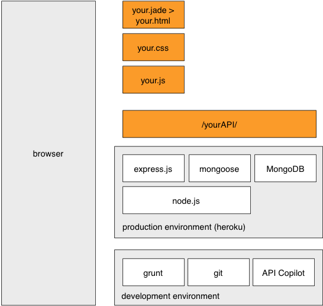
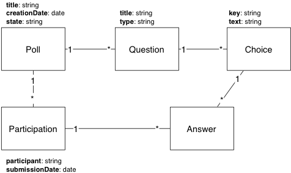
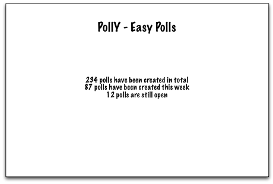

# Project specifications, Part 1

## Introduction

As described in the main project page, one goal of the first project phase will be to create a project skeleton and to focus on the server-side technologies. You will design a REST API and implement it with express.js. You will store data in a MongoDB database (with the Mongoose library). You will deploy everything in the cloud and validate your work with an automated test procedure.

The architecture of the system that you will build is shown in the following diagram. Note that:

* In the development environment, you will use grunt to automate your build process. You will use API Copilot to populate your database with test data and validate your implementation. You will use git to push your application to the production environment (on heroku).

* In the production environment, you will have access to a node.js environment and to a MongoDB database. You will write an application on top of the express.js framework and use the mongoose library to interact with the database.

* In your application, you will serve both static content (a very simple landing page with a tiny bit of dynamic content fetched via AJAX) and implement a REST API.

* To create the static content, you will use one of the available template engines (jade) instead of writing full HTML.

## Domain model

The minimum domain model that you will implement is shown in the following diagram. Note the following elements:

* A **Poll** can contain several multiple-choice **Questions**. A poll can be in different states: *draft*i, *active* and *closed*.

* For every question, there can be several **Choices**.

* A user can answer questions in a poll. This creates a **Participation** entity.

* A **Participation** contains several **Answers**.

* Every **Answer** is related to one **Question** and one **Choice**.

## UI flow

The user interface that you will develop will be extremely simple. You will only implement a landing page, where you will display the name of your product (it should be something else than PollY...) and various statistics. Nevertheless, you should take the following elements in consideration:

* the page must be served by express.js and you should implement the MVC pattern correctly.

* you must find a nice-looking template (based on Bootstrap or other) and integrate it in your page.

* you must write the markup with the Jade markup language (instead of HTML).

* the page must be available on the Web; for that purpose, the application must be deployed on the heroku cloud infrastructure.

* you must implement an automated test procedure that validate that the statistics displayed on the page are correct.

## REST API

A very important part of the work will be the design and the implementation of the REST API. Even with a simple domain model, there are several interesting questions that you will need to consider:

* what is the granularity of the payloads (e.g. 1 payload for every question or 1 payload for a poll with all questions)?

* how are associations between entities captured in the payloads (e.g. ids vs URLs)?

* how are actions supported by the API (e.g. what is the way to change the state of a poll?)

* are there use cases for partial updates and how to implement them? (e.g. how to change one question within a poll?)

## Testing and validation

You will validate your implementation with the following test strategy:

* firstly, you will implement a method for **generating test data** (Polls, questions, participations, etc.). You must use your REST API for that purpose. We strongly recommend that you use [API Copilot](https://github.com/AlphaHydrae/api-copilot).

* secondly, you will validate that the content of the database (the generated test data) and the statistics displayed on the landing page are correct. You must also consider that closing of polls.

## Documentation

In the first part of the project, you must also create a product page to present your ideas (the features that you plan to implement in the second and third phases). You are asked to use GitHub Pages (and Jekyll) for that purpose. You must also integrate a nice-looking template in your product page (there are free and cheap ones available).

## Specifications

Remember that while you implement the first set of requirements, you must also specify what you plan to implement in the second and third project phases. You must write a document that:

* describes the vision of product (what is its goal? who are the target users? what will they be able to do with the service? what is the high-level architecture?)

* gives a list of features that will be available to the different types of users?

* provides mockups for the user interfaces that you want to develop. You can use a drawing program or even scan sketches drawn by hand. The important thing is put yourself in the head of the users and to be critical about the ease of use and efficiency of the UI. You will need several iterations to get it right. You will need to show it to different (external) people to validate your choices.

